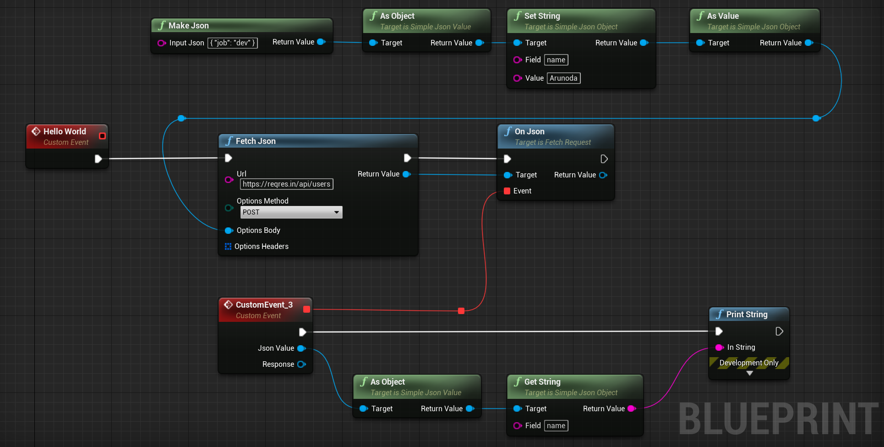

# Unreal Fetch

The [Fetch API](https://developer.mozilla.org/en-US/docs/Web/API/Fetch_API/Using_Fetch) inspired HTTP Client for Unreal Engine. Works with both Blueprints & C++.

**[Watch the Demo](https://www.youtube.com/watch?v=DPVwaP792MA&feature=youtu.be)**

## Features

With this plugin, you can talk to HTTP APIs very quickly from Blueprints. Here are some core features:

* No C++ or configurations needs when using with Blueprints
* Talk to HTTP Apis with a minimal amount of Blueprint nodes
* Allow to parse & make JSON values via Blueprints
* Works anywhere since this uses internal HTTP & JSON related modules.

## Installation

[**This plugin is available on the Unreal Marketplace.**](https://www.unrealengine.com/marketplace/en-US/product/fetch-a-simple-http-client)
 
[ [Read more](#about-licence--charging-on-the-marketplace) on why we charge for this plugin on the marketplace. ]

Follow these steps to install this plugin via the source.

* Close your existing Unreal Engine app.
* Create a directory in your app root called `Plugins`.
* Download [this](https://github.com/GameDev4K/unreal-fetch/archive/main.zip) GitHub repository.
* Copy `Plugins/UnrealFetch` of the repository to above created `Plugins` directory.
* Start your app & it will ask to compile the plugin. Proceed with that.
* You might need to [setup Visual Studio](https://docs.unrealengine.com/en-US/ProductionPipelines/DevelopmentSetup/VisualStudioSetup/index.html) for Unreal Engine.

## Usage with Blueprints

**[Watch this video](https://www.youtube.com/watch?v=DPVwaP792MA&feature=youtu.be)** for step by step instructions on how to use this plugin.

Once installed, you can use the `Fetch` static function inside Blueprints to talk to any HTTP API. Here's [an example](https://blueprintue.com/blueprint/kxwkx692/) on invoking a HTTP POST request & extracting the email from the response JSON.

Refer to the following examples for more usage: 
(You can copy blueprint nodes from the following examples & directly paste them inside your blueprints.)

**For Fetch**

* [Hello World - Making a POST Request](https://blueprintue.com/blueprint/kxwkx692/)
* [Check Response Headers](https://blueprintue.com/blueprint/xof4e7_w/)
* [Check Status Code](https://blueprintue.com/blueprint/2p_7qg05/)
* [Handle Errors](https://blueprintue.com/blueprint/tixgg4iv/)
* [Use Custom Headers](https://blueprintue.com/blueprint/4g6x2y-h/)
* [Using BasicAuth](https://blueprintue.com/blueprint/cv0dcy71/)

**For JSON**
* [Basic JSON Usage](https://blueprintue.com/blueprint/2ayz0vbn/)
* [Working with Arrays](https://blueprintue.com/blueprint/k4fbbdse/)
* [Check for there's a key or not](https://blueprintue.com/blueprint/okwmyljw/)
* [Runtime JSON Validation](https://blueprintue.com/blueprint/dnpnrs8m/)
* [Get an item inside an Array](https://blueprintue.com/blueprint/wj-v1k6i/)
* [Loop through a JSON Array](https://blueprintue.com/blueprint/umgnh13w/)
* [Find a specific item in a JSON Array](https://blueprintue.com/blueprint/l4cwvkqj/)

## Functional Test Suite

All the tests for this plugin written as Functional Tests & they are based on Blueprints. That's a good place to search for each & every functionality of this plugin.

Here's how to access & run them:

* Clone this repository & run the app [UnrealFetchDevApp](./UnrealFetchDevApp)
* Check `Content/Tests` from the content browser for various blueprints with test cases.
* Open the test runner with `Windows -> Test Automation`.
* Open the Automation tab & search for `Functional Tests`.
* Select all those tests & run them all.

## About Licence & Charging on the Marketplace

We [sell this plugin](https://www.unrealengine.com/marketplace/en-US/product/fetch-a-simple-http-client) on the unreal marketplace for 4.99 USD. 

As you already know, you can get this plugin for FREE via this repository. Since the plugin is under the MIT license, you can even use this plugin for any purpose without paying.

If you get this plugin via the marketplace, you will get the pre-compiled version & you can get updates instantly. But if you get it from this repository, you need to compile it locally and manually check for updates.

We do this to cover the development cost (we hope to 😁) while allowing everyone to use this plugin even if they couldn't afford to pay.

## Bugs, Questions & Features

No software is free of bugs or comes with all of the features you would imagine. So, **[let's talk](https://github.com/GameDev4K/unreal-fetch/issues)**.